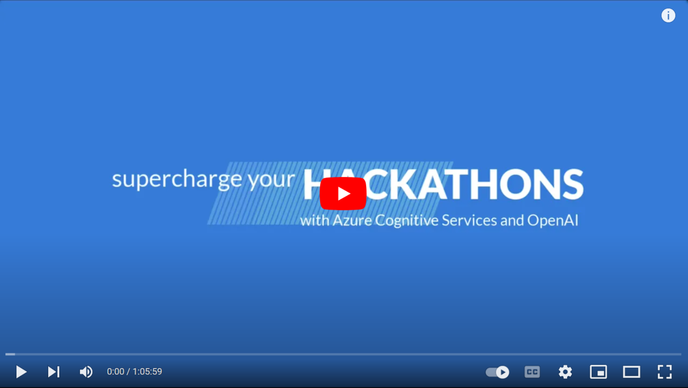

# AOAI Hack Pack
Reference this page at: [aka.ms/AOAI-Hack-Pack](https://aka.ms/AOAI-Hack-Pack)
- **[Organisation] Planning an innovation hackathon?** Make sure you've sorted out the [Logistics](https://aka.ms/AOAI-Hack-logistics)⚠️
- **[Hack team] Know what you want to build?** Go straight to the [Resource Packs](https://aka.ms/AOAI-Hack-packs)🎒

## Who is this pack for?
This Hack Pack is designed for organisations who are planning to run an **innovation hackthon** with internal teams, or who have 1 or more teams participating in a hackathon event run by someone else. This Hack Pack can also be used as a resource by Service Partners or facilitators who are helping organisations and hack teams get ready for an innovation hackathon.

## What is an innovation hackathon?
Imagine this: Developers (and product, design, and marketing folks) splitting into teams, imagining anything that can be possible using improve features or internal workflows, using a day to a couple weeks hacking that idea into something demonstratable, and finally judging and deciding which teams/projects are winners or have an idea that can be adopted into prod/roadmap. **This is what we mean by innovation hackathons.**

Importantly, this is about innovation, where there is no set definition of what the teams will build, and every teams will have a different outcome from the hackathon. There can be guidelines, but ultimately the teams are coming up with their own ideas (innovation) and making it happen over days/weeks.

There are other types of events that get called "hackathons", such as:
- workshops
- bootcamps
- hands on labs
- GitHub accelerators
- or the likes where there is a set outcome and instructions all teams follow. **These are other great ways to get teams started with building, but we are not talking about these types of hackathons in this Hack Pack.**

## Can't wait for us to finish building this out?
Check out https://aka.ms/ai-hackathon-starter-kit, for a kit you can deploy and get started with hacking straight away!
 

